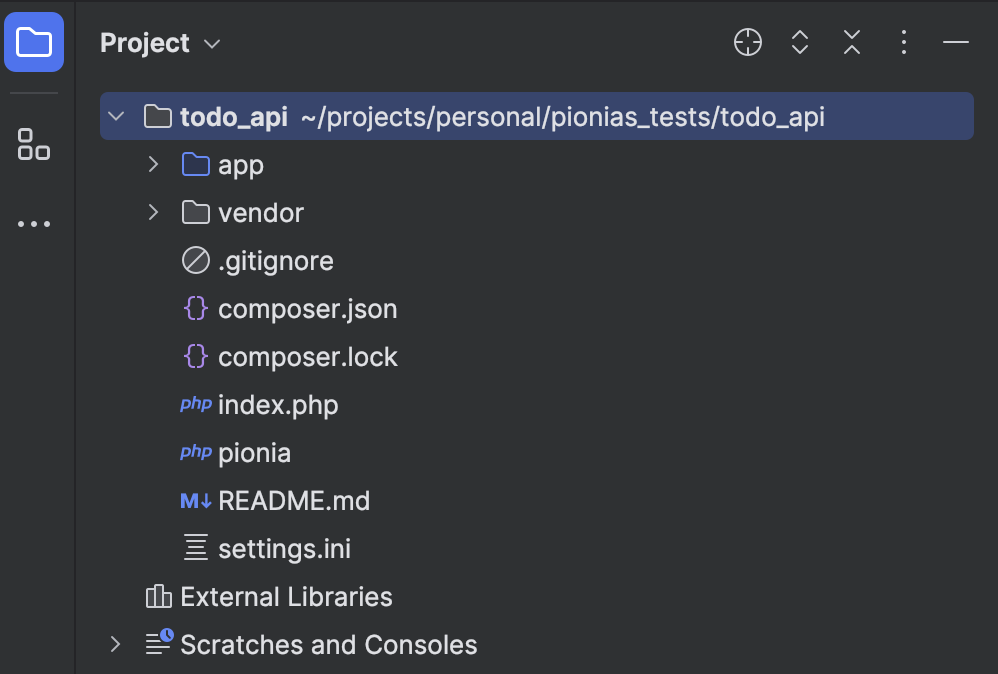



This section assumes that you have already setup your pinia framework project. If you haven't done done, please head over to [Installation](/documentation/introduction/#installation).

This guide also introduces you to the implementation of the [Moonlight architecture](/docs/moonlight/), so you can check it out first to get familiar with the terminologies.



## Out Target

We should be able to accomplish the following tasks by the end of this tutorial:

1. Intialise the project.
2. Connect to an existing database.
3. Create a todo service.
4. Create a new to-do item in the database.
5. Retrieve all to-do items from the database.
6. Retrieve a single to-do item from the database.
7. Update a to-do item in the database.
8. Delete a to-do item from the database.

### Prerequisites

- You should have a basic understanding of PHP.
- You should have postman installed on your machine for testing the API.
- You should have a database created already.

### Step 1: Initialize the project

To create a new project, you need to run the following command in the directory you want your project to be created. We are calling ours `todo_api`.

```bash
composer create-project pionia/pionia-app todo_api
```

We can open the project in our favorite code editor or IDE, for this tutorial we will be using PhPStorm IDE.

> All IDEs and IDEs should be okay to use since Pionia is powered by PHP that is supported by most of the IDEs.

Directory structure of the project should look like this:



For explanation of the directories and scripts, please refer to the [Structure Section of this documentation](/documentation/structure/).

### Step 2: Connect to the database

Assuming you have already setup your MySQL database.

Let's first create our MySQL database as below:

```sql
CREATE DATABASE todo_db;

USE todo_db;

```

Then we can create a table called `todos` as below:

```sql
create table if not exists todos (
  id int auto_increment primary key,
  title varchar(200) not null,
  description text,
  created_at timestamp default CURRENT_TIMESTAMP
);

desc todos;
```

Above should return the following:


Open `settings.ini` file and update the database settings as below:

```ini {title="settings.ini"}
[db]
name = "todo_db"
user = "root" # your database user
driver = "mysql"
host = "localhost"
password = "" # your database password
port = 3306
```

### Step 3: Create the service - `TodoService`

Since all our business logic is related to To-do items, we only need one service called `TodoService`. Head over to services directory and add the following code to `TodoService.php`: All our services should extend `BaseRestService` class.

```php
<?php

<?php {title="TodoService.php"}

namespace application\services;


use Pionia\request\BaseRestService;

class TodoService extends BaseRestService
{

}
```

After creating our service, we need to register it in the `MainApiSwitch` class. Open `MainApiSwitch.php` and add the following code:

```php {title="MainApiSwitch.php"}
public function registerServices(): array
    {
        return [
            'user' => new UserService(),
            "todo" => new TodoService(), // add this line here
        ];
    }
```

Now our service is discoverable by the framework.


### Step 4: Create a new to-do item in the database - 1st action.

We create our first action in our service called 'create'. This action will be responsible for creating a new to-do item in the database.

```php {title="TodoService.php"}
namespace application\services;


use Pionia\request\BaseRestService;

class TodoService extends BaseRestService
{
  public function create($data) : BaseResponse
    {
        $title = $data['title'];
        $description = $data['description'];

        $builder = new QueryBuilder();

        $stmt = $builder->connection->prepare("INSERT INTO todos(title, description) VALUES(:title, :description)");
        $stmt->bindValue(':title', $title);
        $stmt->bindValue(':description', $description);

        $stmt->execute();

        $lastInserted = $builder->connection->lastInsertId('id');

        $inserted = $builder->one("SELECT * from todos WHERE id = :id", [ 'id' => $lastInserted ]);

        return BaseResponse::JsonResponse(0, "Todo $inserted->title created.", $inserted, $lastInserted);
    }
}
```

Sending the request using any client of choice.





```js
  const axios = require('axios');
  const FormData = require('form-data');
  let data = new FormData();
  data.append('title', 'Pass this ');
  data.append('description', 'Must pass this');
  data.append('SERVICE', 'todo');
  data.append('ACTION', 'create');

  let config = {
    method: 'post',
    maxBodyLength: Infinity,
    url: 'http://localhost:8000/api/v1/',
    headers: {
      ...data.getHeaders()
    },
    data : data
  };

  axios.request(config)
  .then((response) => {
    console.log(JSON.stringify(response.data));
  })
  .catch((error) => {
    console.log(error);
  });
```




```js
  const axios = require('axios');
  let data = JSON.stringify({
    "SERVICE": "todo",
    "ACTION": "create",
    "title": "Become an avenger",
    "description": "Make sure you become an avenger at 10!"
  });

  let config = {
    method: 'post',
    maxBodyLength: Infinity,
    url: 'http://localhost:8000/api/v1/',
    headers: {
      'Content-Type': 'application/json'
    },
    data : data
  };

  axios.request(config)
  .then((response) => {
    console.log(JSON.stringify(response.data));
  })
  .catch((error) => {
    console.log(error);
  });
```



```js
  var data = JSON.stringify({
    "SERVICE": "todo",
    "ACTION": "create",
    "title": "Become an avenger",
    "description": "Make sure you become an avenger at 10!"
  });

  var xhr = new XMLHttpRequest();
  xhr.withCredentials = true;

  xhr.addEventListener("readystatechange", function() {
    if(this.readyState === 4) {
      console.log(this.responseText);
    }
  });

  xhr.open("POST", "http://localhost:8000/api/v1/");
  xhr.setRequestHeader("Content-Type", "application/json");
```



On Successful execution, the above code should return the following:

```json
{
    "returnCode": 0,
    "returnMessage": "Todo Become an avenger created.",
    "returnData": {
        "id": 2,
        "title": "Become an avenger",
        "description": "Make sure you become an avenger at 10!",
        "created_at": "2024-05-26 00:11:23"
    },
    "extraData": "2"
}
```

And in the database, we should have the following:



Before we proceed, let's first understand what just happened above.


When you hit the endpoint `http://localhost:8000/api/v1/` with the data as shown above, the request came via our `index.php`, which checked out routes. We only have one route as follows:-

```php {title="routes.php"}

$router->addGroup('application\Controller')
    ->post('api_v1', 'api_version_one');

```

The above route implies that all post requests to our only controller should be handled by an action(method) named 'api_v1'.

Therefore, in our controller, the following method was executed:

```php {title="Controller.php"}

  public function api_v1(Request $request): BaseResponse
    {
        try {
            return MainApiSwitch::processServices($request);
        } catch (Exception $e) {
            return BaseResponse::JsonResponse(400, $e->getMessage());
        }
    }
```

The above does two things:
 > Maps the whole request to the `MainApiSwitch` class which is responsible for mapping the request to the service mentioned.

 > Catches any exception that might be thrown during the process and returns a 200 OK response with a returnCode of 400.

The main api switch checks in the request body for the `SERVICE` and `ACTION` keys. If they are not found, it throws an exception. If they are found, it maps the request to the service and action mentioned basing on the registered services. Therefore, for your service to be discovered, you must register it [as we did here](#step-3-create-the-service---todoservice).

```php {title="MainApiSwitch.php"}
  public function registerServices(): array
    {
        return [
            'user' => new UserService(),
            "todo" => new TodoService(), // this is our service.
        ];
    }
```

So, after here, the service needed is loaded and the entire request in forwarded to it. When the service receives the request, it checks for the action mentioned in the request body. If the action is not found, it throws an exception. If the action is found, it executes the action and returns a response back to the MainApiSwitch which then returns the response to the controller which then returns the response to the kernel that does final processing and returns the response to the client.

### Step 5: Retrieve all to-do items from the database - 2nd action.

We created our todo from the above step, please first take time to create as many as you want.

Now, let's create an action called `all` in our service to retrieve all to-do items from the database.

```php {title="TodoService.php"}
## ..rest of the service code
public function all() : BaseResponse
  {
      $builder = new QueryBuilder();

      $data = $builder->all("SELECT * from todos");
      return BaseResponse::JsonResponse(0, "Todos found.", $data);
  }

## rest of the service code...

```

Now, let's change our JSON in postman to the following:

```json
{
    "SERVICE": "todo",
    "ACTION": "all"
}
```

Send the request and you should get the following response:

```json
{
    "returnCode": 0,
    "returnMessage": "Todos found.",
    "returnData": [
        {
            "id": 1,
            "title": "Pass this ",
            "description": "Must pass this",
            "created_at": "2024-05-26 00:04:17"
        },
        {
            "id": 2,
            "title": "Become an avenger",
            "description": "Make sure you become an avenger at 10!",
            "created_at": "2024-05-26 00:11:23"
        }
    ],
    "extraData": null
}
```




Notice how the `returnData` is an array yet it was an object in the previous response. `returnData` and `extraData` can be of any type, it is up to you to decide what to return in them.

You can also omit the message by setting it to null which should be logical for cases of listing items.



### Step 6: Retrieve a single to-do item from the database - 3rd action.

We will create an action called `one` in our service to retrieve a single to-do item from the database.

```php {title="TodoService.php"}
## ..rest of the service code
  /**
   * @throws DatabaseException
   */
  public function one($data) : BaseResponse
  {
      $id = $data['id'];

      $builder = new QueryBuilder();

      $res = $builder->one("SELECT * from todos WHERE id = :id", [ 'id' => $id ]);

      if ($res) {
          return BaseResponse::JsonResponse(0, null, $data);
      } else {
          throw new DatabaseException("No todo with id $id found.");
      }
  }
## ..rest of the service code
```

Here we are going to test two scenarios, one is where everything goes smoothly and the other is where the server panics(throws an exception).

```json
{
    "SERVICE":"todo",
    "ACTION": "one",
    "id": 2
}
```

```json
{
    "SERVICE": "todo",
    "ACTION": "one",
    "id": 100
}
```

In the first scenario, we get back a status code of 200 OK but with the following response.

```json
{
    "returnCode": 0,
    "returnMessage": null,
    "returnData": {
        "SERVICE": "todo",
        "ACTION": "one",
        "id": 2
    },
    "extraData": null
}
```

But in the second scenario, we still get a status code of 200 OK but with the following response.

```json
{
    "returnCode": 400,
    "returnMessage": "No todo with id 100 found.",
    "returnData": null,
    "extraData": null
}
```


Notice how the exception message becomes our `returnMessage`. This exception was caught by our controller. Therefore, wherever you're in the services, feel free to throw any exceptions with clean messages.



### Step 7: Update a to-do item in the database - 4th action.

However much this would endup being an independent action of its own, we are going to use the same action `create` to update our to-do item.

```php {title="TodoService.php", linenos=true, hl_lines=[10,"12-19", 26]}
## ..rest of the service code

public function create($data) : BaseResponse
    {
        $title = $data['title'];
        $description = $data['description'];

        $builder = new QueryBuilder();

        $id = $data['id'] ?? null;

        if ($id){
            // here we are updating
            $stmt = $builder->connection->prepare("UPDATE todos SET title = :title, description = :description WHERE id = :id");
            $stmt->bindParam(':id', $id);
        } else {
            // here we are creating
            $stmt = $builder->connection->prepare("INSERT INTO todos(title, description) VALUES(:title, :description)");
        }

        $stmt->bindValue(':title', $title);
        $stmt->bindValue(':description', $description);

        $stmt->execute();

        $lastInserted = $id ?? $builder->connection->lastInsertId('id');

        $inserted = $builder->one("SELECT * from todos WHERE id = :id", [ 'id' => $lastInserted ]);

        return BaseResponse::JsonResponse(0, "Todo $inserted->title created.", $inserted, $lastInserted);
    }
    ## ..rest of the service code
```

Changed/Added lines are highlighted. The above should be returning the following:

```json
{
    "returnCode": 0,
    "returnMessage": "Todo Become an avenger-updated created.",
    "returnData": {
        "id": 2,
        "title": "Become an avenger-updated",
        "description": "Make sure you become an avenger at 10!",
        "created_at": "2024-05-26 00:11:23"
    },
    "extraData": "2"
}
```

### Step 8: Delete a to-do item from the database - 5th action.

If you followed along upto this far, you should be able to implement this on your own. If you get stuck, you can refer to the code below.

```php {title="TodoService.php"}
public function delete($data) : BaseResponse
  {
      $id = $data['id'];
      $builder = new QueryBuilder();
      $res = $builder->connection->prepare("DELETE FROM todos WHERE id = :id");
      $res->bindParam(':id', $id);
      $res->execute();
      return BaseResponse::JsonResponse(0, "Todo deleted.");
  }
```

Change your request object to the following in your client(postman).

  ```json
  {
      "SERVICE": "todo",
      "ACTION": "delete",
      "id": 2
  }
  ```

If you did everything right, you should get your response as follows

```json
{
    "returnCode": 0,
    "returnMessage": "Todo deleted.",
    "returnData": null,
    "extraData": null
}
```



1. All our requests are made via POST method.
2. All our requests have similar body structure, they have a `SERVICE`, `ACTION`, and other param keys.
3. All our responses have the same response format, `returnCode`, `returnMessage`, `returnData`, and `extraData` keys.
4. We are hitting the same endpoint `http://localhost:8000/api/v1/` for all our requests.
5. We did not touch the controller, routes, or the kernel. but we only focused on the service.

This is the beaty of the Moonlight architecture. It makes it easy to understand and maintain your code.

Imagine how fast you would pull off a new feature with Pionia.



### Tutorial Source Code



```php {title="TodoService.php"}
<?php

namespace application\services;


use Pionia\database\QueryBuilder;
use Pionia\exceptions\DatabaseException;
use Pionia\request\BaseRestService;
use Pionia\response\BaseResponse;

class TodoService extends BaseRestService
{
    public function create($data) : BaseResponse
    {
        $title = $data['title'];
        $description = $data['description'];

        $builder = new QueryBuilder();

        $id = $data['id'] ?? null;

        if ($id){
            // here we are updating
            $stmt = $builder->connection->prepare("UPDATE todos SET title = :title, description = :description WHERE id = :id");
            $stmt->bindParam(':id', $id);
        } else {
            // here we are creating
            $stmt = $builder->connection->prepare("INSERT INTO todos(title, description) VALUES(:title, :description)");
        }

        $stmt->bindValue(':title', $title);
        $stmt->bindValue(':description', $description);

        $stmt->execute();

        $lastInserted = $id ?? $builder->connection->lastInsertId('id');

        $inserted = $builder->one("SELECT * from todos WHERE id = :id", [ 'id' => $lastInserted ]);

        return BaseResponse::JsonResponse(0, "Todo $inserted->title created.", $inserted, $lastInserted);
    }

    public function all() : BaseResponse
    {
        $builder = new QueryBuilder();

        $data = $builder->all("SELECT * from todos");
        return BaseResponse::JsonResponse(0, "Todos found.", $data);
    }

    /**
     * @throws DatabaseException
     */
    public function one($data) : BaseResponse
    {
        $id = $data['id'];

        $builder = new QueryBuilder();

        $res = $builder->one("SELECT * from todos WHERE id = :id", [ 'id' => $id ]);

        if ($res) {
            return BaseResponse::JsonResponse(0, null, $data);
        } else {
            throw new DatabaseException("No todo with id $id found.");
        }
    }

    public function delete($data) : BaseResponse
    {
        $id = $data['id'];
        $builder = new QueryBuilder();
        $res = $builder->connection->prepare("DELETE FROM todos WHERE id = :id");
        $res->bindParam(':id', $id);
        $res->execute();
        return BaseResponse::JsonResponse(0, "Todo deleted.");
    }
}
```



## Post Tutorial -- What Next?


