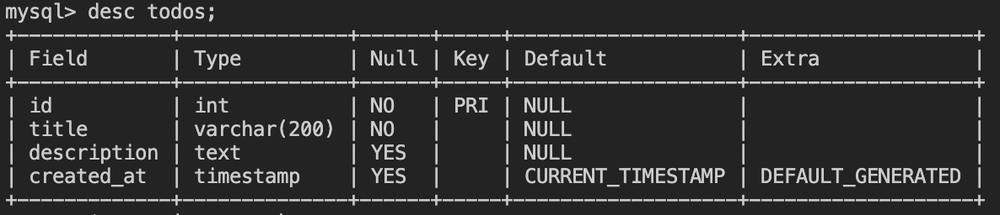
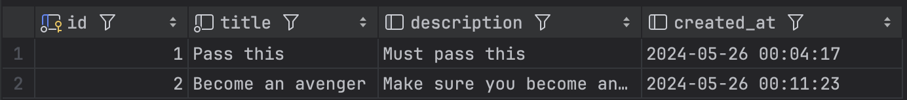



This section assumes that you have already setup your Pionia framework project. If you haven't done that, please head over to [Installation section for details](/documentation/introduction/#installation).

This guide also introduces you to the implementation of the [Moonlight architecture](/moonlight/introduction-to-moonlight-architecture/), so you can check it out first to get familiar with the terminologies.



## Out Target

We should be able to accomplish the following tasks by the end of this tutorial:

1. [ ] Initialize the project.
2. [ ] Connect to a database.
3. [ ] Create your first service.
4. [ ] Create or update a to-do item in the database.
5. [ ] Retrieve all to-do items from the database.
6. [ ] Retrieve a single to-do item from the database.
7. [ ] Retrieve n random to-do item[s] from the database.
8. [ ] Delete a to-do item from the database.

### Prerequisites

- You should have a basic understanding of PHP.
- You should have postman installed on your machine for testing the API.
- You should have a database created already.

### Step 1: Initialize the project

To create a new project, you need to run the following command in the directory you want your project to be created. We are calling ours `todo_api`.

```bash
composer create-project pionia/pionia-app todo_api
```

We can open the project in our favorite code editor or IDE, for this tutorial we will be using PhPStorm IDE.

> All IDEs and Editors should be supported for use since Pionia is powered by PHP that is supported by most of the IDEs.

For explanation of the directories and scripts, please refer to the [Structure Section of this documentation](/documentation/structure/).

To confirm that our installation works fine, let's just go start our server. Open the terminal in the root of the project and run the following command.
```bash
php pionia serve
```
If everything is setup correctly, your project should be up and running on http://127.0.0.1:8000. Visiting this url, you should see the following page.



We can test if our APIs are also working fine by visiting http://127.0.0.1:8000/api/v1/.
It should return the following in the browser.
```json
{
  "returnCode":0,
  "returnMessage":"pong",
  "returnData":{
    "framework":"Pionia Framework",
    "version":"2.0.2",
    "port":8000,
    "uri":"\/api\/v1\/",
    "schema":"http"
  },
  "extraData":null
}
```
- [x] Initialize the project(Completed)

### Step 2: Connect to a database

Pionia removes the section of models and migrations and instead uses a simple and lightweight query builder to [interact with the database - PORM](/documentation/database).

At its heart, PORM was initially a wrapper on top of [medoo](https://medoo.in/), a lightweight database framework that makes interacting with the database easy and fun.
However, from `v2.0^`, the core medoo package was re-written to meet Pionia-specific needs and added to the core Pionia.

> You can create a new database or use an existing one as you see fit!

Assuming you have already setup your MySQL database.

Let's first create our MySQL database as below:

```sql
CREATE DATABASE todo_db;

USE todo_db;

```

Then we can create a table called `todos` as below:

```sql
create table if not exists todos (
  id int auto_increment primary key,
  title varchar(200) not null,
  description text,
  created_at timestamp default CURRENT_TIMESTAMP
);

desc todos;
```

```sql
INSERT INTO todos (title, description) VALUES 
('Grocery Shopping', 'Buy milk, eggs, and bread.'),
('Workout', 'Attend yoga class at 6 PM.'),
('Read a Book', 'Finish reading "The Great Gatsby."'),
('Clean the House', 'Dust and vacuum the living room and kitchen.'),
('Schedule Doctor Appointment', 'Book a check-up for next week.'),
('Plan Weekend Trip', 'Research destinations and book accommodations.');

select * from todos; ## Select All Added todos
```

Above should return the following:



Database configurations in the `environment` folder should be done in any `.ini` files. 
You can create a dedicated `environment/database.ini` file or just use the existing `environment/settings.ini`.


But why do we have have to do this from `.ini` files?

Pionia supports connection to multiple database at ago. Using `.ini` files, these can just be sections.
Forexample, our first database can called `[db]`, and then our second can `[db2]`. Pionia will auto-discover these 
and collect them in the `container` as needed. To set a database as the default, just add `default=1` or `default=true` in its section.


Open `settings.ini` file and update the database settings as below:

```ini {title="settings.ini"}
[db]
database_name = "todo_db" # your database name
username = "root" # your database user
database_type = "mysql" # your database type
host = "localhost"
password = "" # your database password
port = 3306
default=true # to mark it as our default db connection
```

- [x] Connect to a database(Completed)

Throughout this tutorial, we will be creating everything manually, however, pionia cli can be used to create most of the staff for you.

Just run the following command in your terminal to see the available commands. And you can always add your own [commands like illustrated in this section](/documentation/commands-pionia-cli/)

```bash
php pionia
```

### Step 3: Create your first service - `TodoService`

Since all our business logic is related to To-do items, we only need one service called `TodoService`.

<b>Points to ponder! </b>

 > All Pionia services reside in the `services` folder under the namespace of `Application\Services`.

 > All Pionia Services should extend `Service` from `Pionia\Http\Services\Service`.

At its most minimal nature, this is a valid Pionia Service. For [details about services, please through the detailed guide here](/documentation/services/services/)
```php {title="TodoService.php"}
<?php

namespace Applications\Services


use Pionia\Http\Services\Service;

class TodoService extends Service
{

}
```

#### Service Registration - Switches.

Pionia introduces the concept of switches to help in api versioning. Be default, your new application already 
consists of `MainApiSwitch` which maps all requests targeting `/api/v1/`. 
When can create switches manually or via the cli, but all in all, these should only define one method `registerServices` which returns 
a Pionia `Pionia\Collections\Arrayable`. In this Arrayable, you can register all your services that should be under the same version like `/api/v1`.
For details, about switches, please head over to [Service Registration](/documentation/services/services/#service-registration) section of services.

For now, let's register our created service in the `MainApiSwitch` class. Open `MainApiSwitch.php` in the `switches` folder and add the following code in our 
`registerServices` method.

```php {title="MainApiSwitch.php"}
public function registerServices(): Arrayable
    {
        return arr([
            'user' => UserService::class,
            'todo' => TodoService::class, // add this line here
        ]);
    }
```

Now our service is discoverable by the framework.

- [x] Create the service(Completed)

### Step 4: Create or update a to-do item in the database - 1st action.

#### Pionia Actions.

To their simplest, these are just class methods with a little sugar-coating. As we have already seen, Pionia services 
are just PHP classes that extend from `Service`. All methods defined in these services(classes) that are suffixed by 
`Action` and return `Pionia\Http\Response\BaseResponse`, are taken to be Pionia Actions. Therefore, any other methods defined in Pionia Service without an `Action` suffix are taken 
to be just class methods not a Pionia Action.

For Details about Pionia Actions, please [read more about the details here](/documentation/services/actions/).

We create our first action in our service called 'createOrUpdateAction'. This action will be responsible for creating a new to-do item in the database or update an existing one if an id is provided.

```php {title="TodoService.php"}
namespace Application\Services;

use Pionia\Collections\Arrayable;
use Pionia\Http\Response\BaseResponse;
use Pionia\Http\Services\Service;

class TodoService extends Service
{
  public function createOrUpdateAction(Arrayable $data) : BaseResponse
    {
        $title = $data->getString("title");
        $description = $data->getString('description');
        $id = $data->getInt("id");

        if (!$id){
            $saved = table("todos")
                ->save(
                    ['title' => $title, 'description' => $description]
                );
            $message = "Todo created successfully!";
        } else {
            db("todos")
                ->update([
                    'title' => $title,
                    'description' => $description,
                ], $id);
            $saved = db("todos")->database->id();
            $message = "Todo updated successfully!";
        }
        return response(0, $message, $saved);
    }
}
```

✨So, briefly to go through what we just did. 

1. We created our action which takes up a Pionia Arrayable `$data` which will always contain our POST request data.
2. We collected our data, `title` and `description` as a string, the `id` as an integer.
3. We checked if we actually have an `id` in our request. If no id was provided, we use the post data given to us to create a new todo, otherwise we updated the matched to-do.
4. Finally, we returned a response using one of our [Pionia Helpers](/documentation/pionia-helpers/)

Sending the request using any client of choice.


So, in the request, using the above, we defined that everytime we define a `SERVICE` or `service` called `todo`, our `TodoService` 
should then be loaded. Remember, all services are lazy-loaded, so, Pionia does not know that this service exists till it's required by the incoming request.

For actions, the same process applies. All actions are lazy-loaded too. 

But how do we then target our actions, a case here, `createOrUpdateAction`? 

To hit out action, another key called `ACTION` or `action` must be passed in our request post data. 

This can target the action name directly as the method name:-

```json
{
  "SERVICE" : "todo",
  "ACTION" : "createOrUpdateAction" 
}
```

Or we can ignore the `Action` suffix like this.
```json
{
  "SERVICE" : "todo",
  "ACTION" : "createOrUpdate" 
}
```

Or if you love snake_case format, you can also pass it like below
```json
{
  "SERVICE" : "todo",
  "ACTION" : "create-or-update" // can also be "create-or-update-action"
}
```






```js
import { Jet } from 'jet-fetch';

const jet =  new Jet({
  baseUrl: 'http://localhost:8000/api/',
});
  
jet
  .moonlightRequest({SERVICE: 'todo', ACTION: 'createOrUpdate', title: 'Pass this ', description: 'Must pass' }, 'v1')
  .then((response) => {
      const { returnCode, returnMessage, returnData, extraData } = response.data;
      console.log(returnCode, returnMessage, returnData, extraData);
  }).catch((error) => {
      console.log(error);
  });

```




```js
  const axios = require('axios');
  const FormData = require('form-data');
  let data = new FormData();
  data.append('title', 'Pass this ');
  data.append('description', 'Must pass this');
  data.append('service', 'todo');
  data.append('action', 'create');

  let config = {
    method: 'post',
    maxBodyLength: Infinity,
    url: 'http://localhost:8000/api/v1/',
    headers: {
      ...data.getHeaders()
    },
    data : data
  };

  axios.request(config)
  .then((response) => {
    console.log(JSON.stringify(response.data));
  })
  .catch((error) => {
    console.log(error);
  });
```




```json
// HTTP POST 1.1 /api/v1/
{
  "SERVICE": "todo",
  "ACTION": "createOrUpdate",
  "title": "Pass this ",
  "description": "Must pass"
}
```




```js
  const axios = require('axios');
  let data = JSON.stringify({
    "SERVICE": "todo",
    "ACTION": "create",
    "title": "Become an avenger",
    "description": "Make sure you become an avenger at 10!"
  });

  let config = {
    method: 'post',
    maxBodyLength: Infinity,
    url: 'http://localhost:8000/api/v1/',
    headers: {
      'Content-Type': 'application/json'
    },
    data : data
  };

  axios.request(config)
  .then((response) => {
    console.log(JSON.stringify(response.data));
  })
  .catch((error) => {
    console.log(error);
  });
```



```js
  var data = JSON.stringify({
    "service": "todo",
    "action": "create",
    "title": "Become an avenger",
    "description": "Make sure you become an avenger at 10!"
    "id": 2 // this is optional, only pass it to update.
  });

  var xhr = new XMLHttpRequest();
  xhr.withCredentials = true;

  xhr.addEventListener("readystatechange", function() {
    if(this.readyState === 4) {
      console.log(this.responseText);
    }
  });

  xhr.open("POST", "http://localhost:8000/api/v1/");
  xhr.setRequestHeader("Content-Type", "application/json");
```



On Successful execution, the above code should return the following:

```json
{
    "returnCode": 0,
    "returnMessage": "Todo updated successfully!",
    "returnData": {
        "id": 1,
        "title": "Become an avenger",
        "description": "Make sure you become an avenger at 10!",
        "created_at": "2024-05-26 00:11:23"
    },
    "extraData": null
}
```

And in the database, we should have the following:





Before we proceed, let's first understand what just happened above.


When you reached the endpoint `http://localhost:8000/api/v1/` with the data as shown above, the request came via our `public/index.php`, which loaded out routes. We only have one route as follows:-

```php {title="bootstrap/routes.php"}

use Application\Switches\MainSwitch;
use Pionia\Http\Routing\PioniaRouter;

$router = (new PioniaRouter())
    ->wireTo(MainSwitch::class);

```

The above route implies that all requests to `http://localhost:8000/api/v1/` should be handled by the `MainApiSwitch` switch.

The main api switch checks in the request body for the `SERVICE` and `ACTION` keys. 
If they are not found, it throws an exception. If they are found, it maps the request to the service and action mentioned basing on the registered services. 
Therefore, for your service to be discovered, you must register it [as we did here](#step-3-create-the-service---todoservice).

So, after here, the service needed is loaded and the entire request in forwarded to it. When the service receives the request, it checks for the action mentioned in the request body. If the action is not found, it throws an exception. If the action is found, it executes the action and returns a response back to our client.

- [x] Create or update a to-do item in the database(Completed)

### Step 5: Retrieve all to-do items from the database - 2nd action.

We created our todo from the above step, please first take time to create as many as you want.

Now, let's create an action called `listAction` in our service to retrieve all to-do items from the database.

```php {title="TodoService.php"}
## ..rest of the service code
  protected function listAction(Arrayable $data): BaseResponse
  {
      return response(0, null, table("todos")->all());
  }

## rest of the service code...

```

Now, let's change our JSON in postman to the following:

```json
{
    "SERVICE": "todo",
    "ACTION": "list"
}
```

Send the request and you should get the following response:

```json
{
    "returnCode": 0,
    "returnMessage": "Todos found.",
    "returnData": [
        {
            "id": 1,
            "title": "Pass this ",
            "description": "Must pass this",
            "created_at": "2024-05-26 00:04:17"
        },
        {
            "id": 2,
            "title": "Become an avenger",
            "description": "Make sure you become an avenger at 10!",
            "created_at": "2024-05-26 00:11:23"
        }
    ],
    "extraData": null
}
```




Notice how the `returnData` is an array, yet it was an object in the previous response. `returnData` and `extraData` can be of any type, it is up to you to decide what to return in them.

You can also omit the message by setting it to null which should be logical for cases of listing items.



- [x] Retrieve all to-do items from the database(Completed)

### Step 6: Retrieve a single to-do item from the database - 3rd action.

We will create an action called `retrieveAction` in our service to retrieve a single to-do item from the database.

```php {title="TodoService.php"}
## ..rest of the service code
  /**
   * @throws DatabaseException
   */
  protected function retrieveAction(Arrayable $data): BaseResponse
    {
        $this->requires('id');

        $id = $data->get('id');

        $todo = db("todos")
            ->get($id);

        if (!$todo){
            throw new Exception("No todo with id $todo found.");
        }

		return response(0, null, $todo);
	}
## ..rest of the service code
```

Here we are going to test two scenarios, one is where everything goes smoothly and the other is where the server panics(throws an exception).

```json
{
    "SERVICE":"todo",
    "ACTION": "retrieve",
    "id": 2
}
```

```json
{
    "SERVICE": "todo",
    "ACTION": "retrieve",
    "id": 100
}
```

In the first scenario, we get back a status code of 200 OK with the following response.

```json
{
    "returnCode": 0,
    "returnMessage": null,
    "returnData": {
      "id": 2,
      "title": "Become an avenger",
      "description": "Make sure you become an avenger at 10!",
      "created_at": "2024-05-26 00:11:23"
    },
    "extraData": null
}
```

But in the second scenario, we still get a status code of 200 OK but with the following response.

```json
{
    "returnCode": 400,
    "returnMessage": "No todo with id 100 found.",
    "returnData": null,
    "extraData": null
}
```


Notice how the exception message becomes our `returnMessage`. This exception was caught by our switch. Therefore, wherever you're in the services, feel free to throw any exceptions with clean messages.


- [x] Retrieve a single to-do item from the database(Completed)

### Step 7: Grab n random to-do item[s] from the database - 7th action.

```php {title="TodoService.php"}

## ..rest of the service code

public function randomAction(Arrayable $data) : BaseResponse
    {
        $length = $data->get('length', 1);
        $todos = db("todos")
            ->random($length);

        return response(0, null, $todos);
    }


```

You can keep hitting this action and on each hit, you should get a different to-do item. You can also play with the `length` parameter to get more or less to-do items.

```json
{
    "SERVICE": "todo",
    "ACTION": "random",
    "length": 1
}
```

- [x] Grab n random to-do item[s] from the database(Completed)

### Step 8: Delete a to-do item from the database - 5th action.

If you followed along upto this far, you should be able to implement this on your own. If you get stuck, you can refer to the code below.

```php {title="TodoService.php"}
public function delete($data) : BaseResponse
  {
      $id = $data['id'];
      Porm::from("todos")->delete($id); // you can now hit 'all' to see if this worked,
      // you should notice item with this id disappears.
      return BaseResponse::JsonResponse(0, "Todo deleted.");
  }

public function deleteAction(Arrayable $data) : BaseResponse
    {
        $this->requires("id")
        $id = $data->get('id');
        
        $todo = db("todos")
            ->delete($id);

        return response(0, "Todo deleted successfully");
    }  
  
```

Change your request object to the following in your client(postman).

  ```json
  {
      "SERVICE": "todo",
      "ACTION": "delete",
      "id": 2
  }
  ```

If you did everything right, you should get your response as follows

```json
{
    "returnCode": 0,
    "returnMessage": "Todo deleted successfully",
    "returnData": null,
    "extraData": null
}
```

- [x] Delete a to-do item from the database(Completed)



1. All our requests are made via POST method.
2. All our requests have similar body structure, they have a `SERVICE`, `ACTION`, and other param keys.
3. All our responses have the same response format, `returnCode`, `returnMessage`, `returnData`, and `extraData` keys.
4. We are hitting the same endpoint `http://localhost:8000/api/v1/` for all our requests.
5. We did not touch the routes or the kernel. but we only focused on the service!

This is the beauty of the Moonlight architecture. It makes it easy to understand and maintain your code.

Imagine how fast you would pull off a new service with Pionia.




## Post Tutorial -- What Next?


