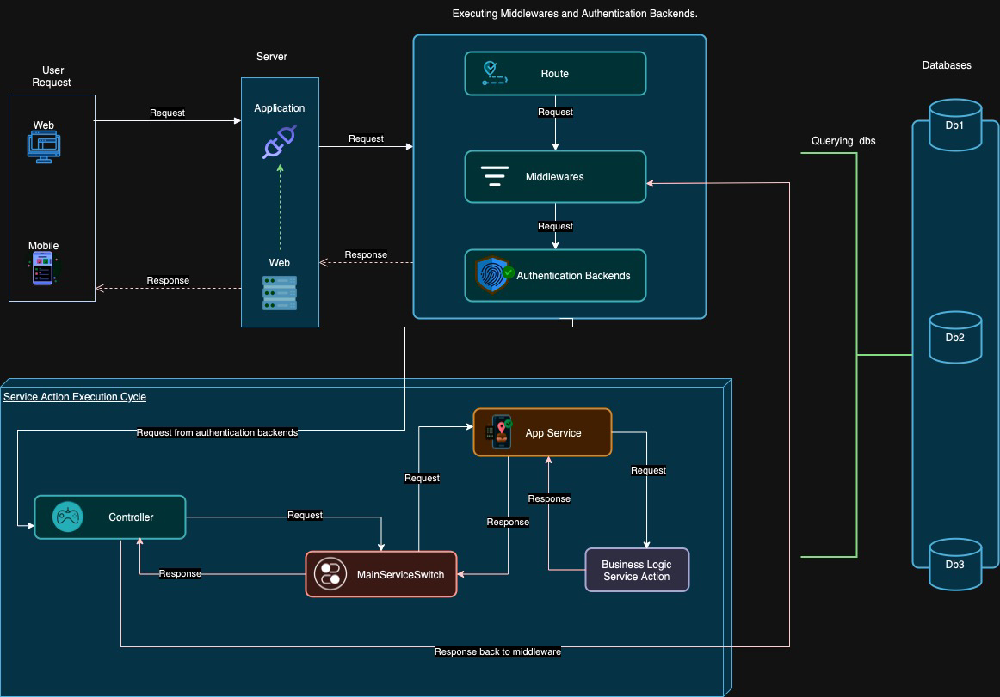

MoonLight is a rather new architecture that is based on the commonly used architectures of gRPC, MVC(Model View Controller), Micro-Services and Monolothic. It picks the best of all these architectures and combines them to create a new architecture that is more efficient and scalable.

## The MoonLight paradigm

Below are the new conventions that MoonLight architecture brings to the table:

Architecture Overview



<!-- add a video showing the same here -->


  Imagine a scenario of a car, the car can have passengers and multiple passengers. The job of the driver is to controll the rest of the car, and the passengers to behave themselves and not interfere with the driver. The driver has one steering wheel in the entire car. Some cars may have a conductor who is responsible for the passengers instead of the driver. This helps the driver to focus on the road and not the passengers.



  Based on the scenario above, the driver is stopped by the traffic police man, the polica man moves to the driver's side and not the passengers side. The police man looks through the driver's window and checks if there are any issues with the passengers. He asks the first passenger to pass over their id, the passenger forwards the id to the driver who then hands it over to the police. He checks and gives it to the driver who then hands it over to the passenger.


***NOTE*** Remember the above scenarios as we dive into the MoonLight architecture

### 1. Single API endpoint/route

In the moonlight, all requests target the same endpoint. This is to ensure that the application is scalable and easy to maintain. This also makes it easier to debug and monitor the application.

Assuming the application is running on `http://localhost:3000`, all requests will be made to `http://localhost:3000/api/v1/`. This is the only endpoint that is exposed to the outside world.

On top of other advantages, now frontend devs don't have to worry about the base URL of the API. They can just make requests to the `/api/v1/` endpoint and the application will handle the rest.



  This is our drivers window in the car scenario.

  For anyone to interact with the application, they must go through this endpoint only.


### 2. POST Requests only

  All requests under moonlight architecture are made using the http method of POST only. This is to ensure that the requests are secure and the data is not exposed in the server logs or in the URL. This also makes it easier to debug and monitor the application. [Read more on security](/moonlight/security-in-moonlight/).

### 3. Single Request Format

  In Moonlight architecture, all requests are made in a similar format. This makes it easier to understand and debug the requests. Requests can either be of type JSON or form-data.

  Every request must define the `SERVICE` and `ACTION` to execute in the request body plus the rest of the payload as required by the service.

  ```json {title="POST http://localhost:3000/api/v1/", hl_lines=[2,3]}
  {
      "SERVICE": "users",
      "ACTION": "get_user_by_profile",
      "profile": "@1233232"
  }
  ```


  The `SERVICE` and `ACTION` are required in every request. The rest of the payload is dependent on the service and action being executed.



  This architecture, if to be well implemented must follow the Object Oriented Programming paradigm.
  With this, `services` should/must be classes or interfaces(golang) that combine together related business logic like `AuthenticationService`, `ProductService`, `OrderService` etc.

  And Actions should be methods in these classes like `login`, `register` in the `AuthenticationService` class.


### 4. Single Response Format

  This architecture also calls for a single response format. This makes it way easier to understand and debug the responses. The response format is as follows:

  ```json {title="Response", hl_lines=[2,3]}
  {
      "statusCode": 0,
      "returnMessage": "Some cool message here or null",
      "returnData": "the data you're sending to the frontend",
      "extraData": "any extra data you want to send to the frontend"
  }
```

With `statusCode`, it implies that the developer/business can define their own custom status codes. However, by convention, a status code of `0` implies success and is recommended to be kept for the same.


### 5. HTTP 200 OK for all.

All requests in this architecture that reach the application server should/must return an http status of 200 OK. The only special case is 502 Gateway Error which is returned when the application server is down or unreachable.



  Think about it, the application server actually handled your request so whether the request raised an exception or successfully executed, the server actually handled.
  And that's what we are actually looking for.



Every time our police man poses a question, he expects an answer. If the driver doesn't have an answer, he should say so(which is also an answer) and not just keep quiet.


### 6. Single Controller Per Application.

In this architecture, there is only one controller that handles all the requests. This controller is responsible for routing the requests to the appropriate service and action.
This makes it easier to maintain and debug the application. This must be one per application.

To achieve api versioning, this controller can have multiple actions each pointing to a different version switch of the application.
Each action can then route the request to the appropriate service switch. 

This point is where the app should handle all exceptions that might be raised by the services and then return a 200 OK response with the appropriate message from the exception raised.

Example using php.

```php {title="Controller"}
  class ApiController extends Controller
  {
      public function v1()
      {
          try {
              // point to the service switch for version one
          } catch (\Exception $e) {
              // handle the exception here
          }
      }

      public function v2()
      {
          try {
              // point to the service switch for version two
          } catch (\Exception $e) {
              // handle the exception here
          }
      }
  }
<?php
```

No logic should be in the controller, it should only be responsible for routing the requests to the appropriate switch.

> For Pionia Framework, this is not required at all, since the framework handles this for you internally!


This is the driver in the car scenario. The driver is responsible with handling all the police man's questions and mapping them to the appropriate passenger.



##### 7. Single Service Switch Per API Version.

In this architecture, there should only be one service switch that handles all the requests for a particular version of the application. This service switch is responsible reading the `SERVICE` in the request and call the responsible service passing it the action(`ACTION`) and the rest of the payload.

The service switch is just a convention to make our controller clean and easy to maintain. It is not a must to have it, but it is recommended. Otherwise, the switching logic would be handled in the controller action responsible for the version.


  This is the conductor in the car scenario. However much the driver can do everything the conductor can do, the conductor is there to reduce work load on the driver.

  This implies that the driver focuses on the road and the conductor focuses on the passengers.

  The controller focuses on mapping the requests, the service switch focuses on mapping the services and actions.


##### 8. Services and Actions

In MoonLight architecture, services are classes or interfaces that combine related business logic. For example, `AuthenticationService`, `ProductService`, `OrderService` etc.

Actions are methods in these classes like `login`, `register` in the `AuthenticationService` class.


  This is the passenger in the car scenario. The passenger is responsible for their own luggage and reaching their destination. They are also responsible with fulfilling the driver's requests.

  Remember, the driver asks the passenger for the id, the passenger passes it over to the driver! Passing the id is the passenger's responsibility(action).


##### 9. Database and Querying

In moonlight architecture, querying the database is highly recommended over using an ORM.
This is because querying the database directly is faster and more efficient than using an ORM.
Also, querying the database directly gives the developer more control over the queries and the data being returned.

All ORMs used in the Moonlight should not map resultsets to models. They should return the resultset as is.

This removes the unnecessary overhead of mapping the resultset to models(model hydration) and makes the application faster and more efficient.

##### 10. Separation of Concerns

In this architecture, the backend is meant to support, command and act as a single source of truth for the frontend. This implies that the architecture requires implementers to implement the frontend and backend separately.

However, this does not discourage serving the two together in production. Frameworks like Spring boot give you the ability to serve your 
entire frontend under your backend. This is highly encouraged. But Moonlight discourages writing of Frontend logic using the backend specific tools like
PHP, Python and others. 

Developers should sorely harness the existence of the frontend tools to write re-usable, modularised and maintainable frontend code.

This way every tool will be maximised to its full potential.

###### Advantages of MoonLight Architecture

1. Scalability :- Since adding new services and actions is easy, the application can be scaled easily.
2. Maintainability :- Small codebase and single-logic services make it easy to maintain the application. Even new developers can easily understand the codebase.
3. Security :- Since all requests are made using POST, the data is secure and not exposed in the Logs. Also, action level authentication and authorization makes it easy to secure the application at lower levels.
4. High Performance :- Architecture stresses on querying the database directly and not using ORMs. This makes the application faster and more efficient. 
5. Developer Performance:- Since the architecture is simple and easy to understand, developers can roll out new features quickly without having to write a lot of boilerplate code.
6. Easy Debugging :- Since all requests and responses are made in a similar format, it is easy to debug the application. Also, the single endpoint makes it easy to monitor the application.
7. Frontend Integration :- One endpoint for all requests, one request format, one response format makes it easy for frontend devs to integrate the api.


###### Disadvantages of MoonLight Architecture

1. Some languages may not support switching between form-data and json requests. This might dictate all uploads to be base64 encoded.
2. Moonlight is only suitable for APIs and not for fullstack applications.
3. The architecture being new, there might be a learning curve for new developers and a small community to get help from.

The community is growing and we are looking forward to having you on board.
